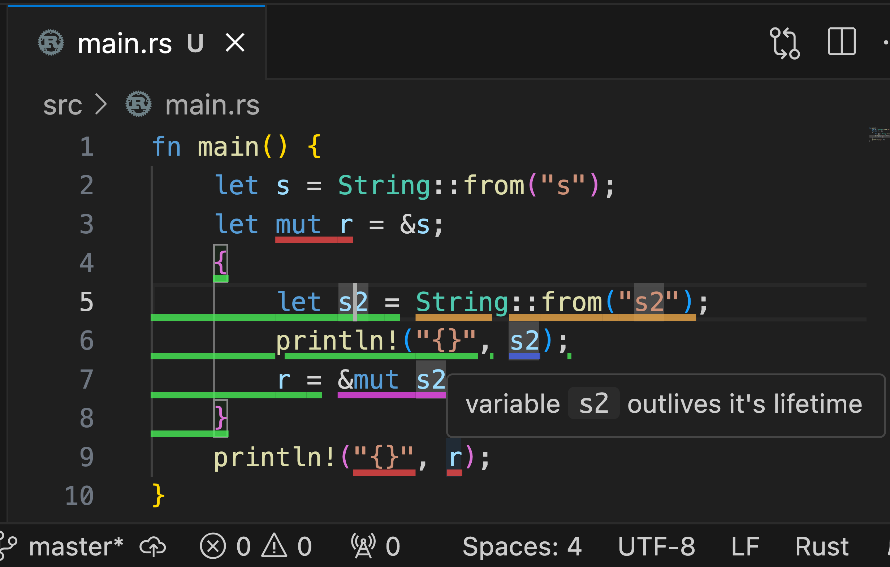

<div align="center">
    <h1>
      🦉<br />
      RustOwl
    </h1>
    <p>
        Visualize ownership and lifetimes in Rust for debugging and optimization
    </p>
    <p>
        
    </p>
</div>

RustOwl visualizes ownership movement and lifetimes of variables.
When you save Rust source code, it is analyzed, and the ownership and lifetimes of variables are visualized when you hover over a variable or function call.

RustOwl visualizes those by using underlines:

- green: variable's actual lifetime
- blue: immutable borrowing
- purple: mutable borrowing
- orange: value moved
- red: lifetime error - diff of lifetime between actual and expected

Currently, we only offer a VSCode extension.

## Quick Start

Here we describe how to start using RustOwl.

### Prerequisite

- `rustup` and `cargo` installed
- Visual Studio Code (VSCode) installed

We tested this guide on macOS Sequoia 15.2 on arm64 architecture with VSCode 1.96.4 and `rustup` 1.27.1.

### Install RustOwl

To install RustOwl, run the command below.

```bash
curl -L "https://github.com/cordx56/rustowl/releases/download/v0.0.2/install.sh" | sh
```

### Download VSCode extension

Download VSCode extension file ( `.vsix` ) from [this link](https://github.com/cordx56/rustowl/releases/download/v0.0.2/rustowl-vscode-0.0.2.vsix).

### Install VSCode extension

Press `Cmd+Shift+P` on macOS or `Ctrl+Shift+P` on other systems to open the command palette in VSCode.
Type `install vsix` in the command palette, and `Extensions: Install from VSIX...` will appear.
Click it and select the downloaded `.vsix` file.
The extension will then be installed.

After installation, the extension will automatically run RustOwl when you save any Rust program in cargo workspace.
The initial analysis may take some time, but from the second run onward, compile caching is used to reduce the analysis time.


## Build manually

Here, we describe manual install instructions from source code.

### RustOwl

#### Prerequisite

- `rustup` and `cargo` installed
    - You can install `rustup` from [this link](https://rustup.rs/).
    - You need to set up the `PATH` environment variable. To do this, follow the instructions provided by the `rustup` installer. For example, in bash, run `export PATH=$HOME/.cargo/bin:$PATH`.

RustOwl has been tested on macOS Sequoia 15.2 on arm64 architecture with `rustup` 1.27.1.
We have not tested the installation of dependencies from other package repositories, such as Homebrew. You may need to uninstall any Rust-related packages installed through those repositories first.
Other dependencies are locked in the configuration files and will be installed automatically.

We have also tested this on Ubuntu 24.04.1 on amd64 architecture with rustup 1.27.1.

Additional dependencies may be required.
We have confirmed that running `apt install -y build-essential` is necessary on a freshly installed Ubuntu for linking.

#### Build & Run

```bash
cd rustowl
cargo install --path . --locked
cargo owl
```


### VSCode extension

#### Prerequisite

- VSCode installed
    - You can install VSCode from [this link](https://code.visualstudio.com/).
- Node.js installed
- `yarn` installed
    - After installing Node.js, You can install `yarn` by running `npm install -g yarn`.

VSCode extension has been tested on macOS Sequoia 15.2 on arm64 architecture with Visual Studio Code 1.96.4, nodejs v20.16.0, and `yarn` 1.22.22.
Other dependencies are locked in the configuration files and will be installed automatically.

#### Build & Run

First, install the dependencies.

```bash
cd rustowl-vscode
yarn install --frozen-locked
```

Then open `rustowl-vscode` directory in VSCode.

A notification to install the recommended VSCode extension will appear in the bottom right corner of VSCode.
Click the install button, wait for the installation to finish, and then restart VSCode.

Open `vscode` directory again, and press the `F5` key in the VSCode window.
A new VSCode window with the extension enabled will appear.

Open cargo workspace directory in the new VSCode window.

When you save Rust files, decoration indicating the movement of ownership and lifetimes will appear in the editor.


## Note

In this tool, due to the limitations of VSCode's decoration specifications, characters with descenders, such as g or parentheses, may occasionally not display underlines properly.
Additionally, we observed that the `println!` macro sometimes produces extra output, though this does not affect usability in any significant way.
