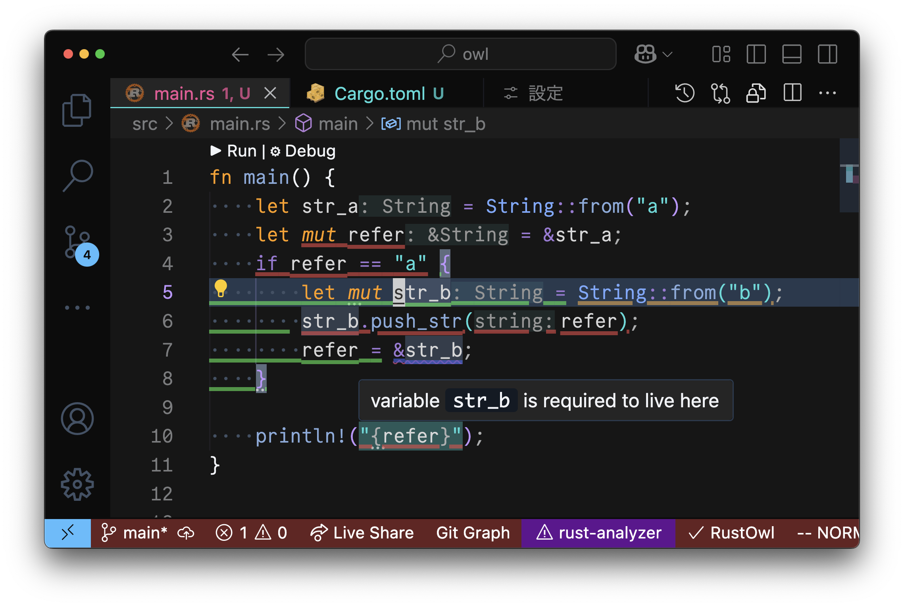

<div align="center">
    <h1>
      <picture>
        <source media="(prefers-color-scheme: dark)" srcset="docs/assets/rustowl-logo-dark.svg">
        
      </picture>
    </h1>
    <p>
        Visualize ownership and lifetimes in Rust for debugging and optimization
    </p>
    <p>
        
    </p>
</div>

RustOwl visualizes ownership movement and lifetimes of variables.
When you save Rust source code, it is analyzed, and the ownership and lifetimes of variables are visualized when you hover over a variable or function call.

RustOwl visualizes those by using underlines:

- 🟩 green: variable's actual lifetime
- 🟦 blue: immutable borrowing
- 🟪 purple: mutable borrowing
- 🟧 orange: value moved / function call
- 🟥 red: lifetime error
    - diff of lifetime between actual and expected, or
    - invalid overlapped lifetime of mutable and shared (immutable) references

Detailed usage is described [here](docs/usage.md).

Currently, we offer VSCode extension, Neovim plugin and Emacs package.
For these editors, move the text cursor over the variable or function call you want to inspect and wait for 2 seconds to visualize the information.
We implemented LSP server with an extended protocol.
So, RustOwl can be used easily from other editor.

## Support

If you're looking for support, please consider checking all issues, existing discussions, and [starting a discussion](https://github.com/cordx56/rustowl/discussions/new?category=q-a) first!

## Quick Start

Here we describe how to start using RustOwl with VS Code.

### Prerequisite

- `cargo` installed
    - You can install `cargo` using `rustup` from [this link](https://rustup.rs/).
- Visual Studio Code (VS Code) installed

We tested this guide on macOS Sequoia 15.3.2 on arm64 architecture with VS Code 1.99.3 and `cargo` 1.86.0.

### VS Code

You can install VS Code extension from [this link](https://marketplace.visualstudio.com/items?itemName=cordx56.rustowl-vscode).
RustOwl will be installed automatically when the extension is activated.

After installation, the extension will automatically run RustOwl when you save any Rust program in cargo workspace.
The initial analysis may take some time, but from the second run onward, compile caching is used to reduce the analysis time.

## Other editor support

We support Neovim and Emacs.
You have to [install RustOwl](docs/installation.md) before using RustOwl with other editors.

You can also create your own LSP client.
If you would like to implement a client, please refer to the [The RustOwl LSP specification](docs/lsp-spec.md).

### Neovim

Minimal setup with [lazy.nvim](https://github.com/folke/lazy.nvim):

```lua
{
  'cordx56/rustowl',
  version = '*', -- Latest stable version
  build = 'cargo binstall rustowl',
  lazy = false, -- This plugin is already lazy
  opts = {},
}
```

<details>
<summary>Recommended configuration: <b>Click to expand</b></summary>

```lua
{
  'cordx56/rustowl',
  version = '*', -- Latest stable version
  build = 'cargo binstall rustowl',
  lazy = false, -- This plugin is already lazy
  opts = {
    client = {
      on_attach = function(_, buffer)
        vim.keymap.set('n', '<leader>o', function()
          require('rustowl').toggle(buffer)
        end, { buffer = buffer, desc = 'Toggle RustOwl' })
      end
    },
  },
}
```

</details>

Default options:

```lua
{
  auto_attach = true, -- Auto attach the RustOwl LSP client when opening a Rust file
  auto_enable = false, -- Enable RustOwl immediately when attaching the LSP client
  idle_time = 500, -- Time in milliseconds to hover with the cursor before triggering RustOwl
  client = {}, -- LSP client configuration that gets passed to `vim.lsp.start`
  highlight_style = 'undercurl', -- You can also use 'underline'
}
```

When opening a Rust file, the Neovim plugin creates the `Rustowl` user command:

```vim
:Rustowl {subcommand}
```

where `{subcommand}` can be one of:

- `start_client`: Start the rustowl LSP client.
- `stop_client`: Stop the rustowl LSP client.
- `restart_client`: Restart the rustowl LSP client.
- `enable`: Enable rustowl highlights.
- `disable`: Disable rustowl highlights.
- `toggle`: Toggle rustowl highlights.


### Emacs

Elpaca example:

```elisp
(elpaca
  (rustowlsp
    :host github
    :repo "cordx56/rustowl"))
```

You have to install RustOwl LSP server manually.

### RustRover / IntelliJ IDEs

There is a [third-party repository](https://github.com/siketyan/intellij-rustowl) that supports IntelliJ IDEs.
You have to install RustOwl LSP server manually.

## Architecture / OS / package repositories

### Archlinux

We have an AUR package. Run:

```sh
yay -S rustowl-bin
```

Replace `yay` with your AUR helper of choice.

We also have a git version, that builds from source:

```sh
yay -S rustowl-git
```

### Nix flake

There is a [third-party Nix flake repository](https://github.com/nix-community/rustowl-flake) in the Nix community.

## Build manually

Here, we describe manual install instructions from source code.

### RustOwl

#### Prerequisite

- `rustup` installed
    - You can install `rustup` from [this link](https://rustup.rs/).
    - You need to set up the `PATH` environment variable. To do this, follow the instructions provided by the `rustup` installer.

Building RustOwl requires nightly build of `rustc`. It will automatically installed by `rustup`.

RustOwl has been tested on macOS Sequoia 15.3.2 on arm64 architecture with `rustup` 1.28.1.
We have not tested the installation of dependencies from other package repositories, such as Homebrew.
You may need to uninstall any Rust-related packages installed through those repositories first.
Other dependencies are locked in the configuration files and will be installed automatically.

We have also tested this on Ubuntu 24.04.2 on amd64 architecture and on Windows 11 Education 23H2 on amd64 architecture.
Additional dependencies may be required.
We have confirmed that running `apt install build-essential` is necessary on a freshly installed Ubuntu for linking.

#### Build & Run

```bash
cargo install --path . --locked
```

You can add runtime directory paths to the search paths by specifying `RUSTOWL_RUNTIME_DIRS` or `RUSTOWL_SYSROOTS`.

### VSCode extension

#### Prerequisite

- VS Code installed
    - You can install VS Code from [this link](https://code.visualstudio.com/).
- Node.js installed
- `yarn` installed
    - After installing Node.js, You can install `yarn` by running `npm install -g yarn`.

VS Code extension has been tested on macOS Sequoia 15.3.2 on arm64 architecture with Visual Studio Code 1.99.3, Node.js v20.16.0, and `yarn` 1.22.22.
Other dependencies are locked in the configuration files and will be installed automatically.

#### Build & Run

First, install the dependencies.

```bash
cd vscode
yarn install --frozen-lockfile
```

Then open `vscode` directory in VS Code.

A notification to install the recommended VS Code extension will appear in the bottom right corner of VS Code.
Click the install button, wait for the installation to finish, and then restart VS Code.

Open `vscode` directory again, and press the `F5` key in the VS Code window.
A new VS Code window with the extension enabled will appear.

Open cargo workspace directory in the new VS Code window.

When you save Rust files, decoration indicating the movement of ownership and lifetimes will appear in the editor.


## Note

In this tool, due to the limitations of VS Code's decoration specifications, characters with descenders, such as g or parentheses, may occasionally not display underlines properly.
Additionally, we observed that the `println!` macro sometimes produces extra output, though this does not affect usability in any significant way.
