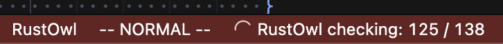
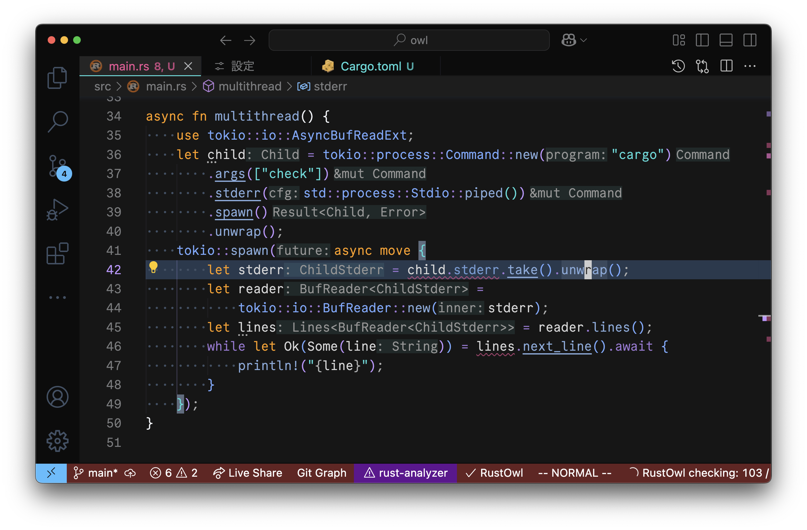
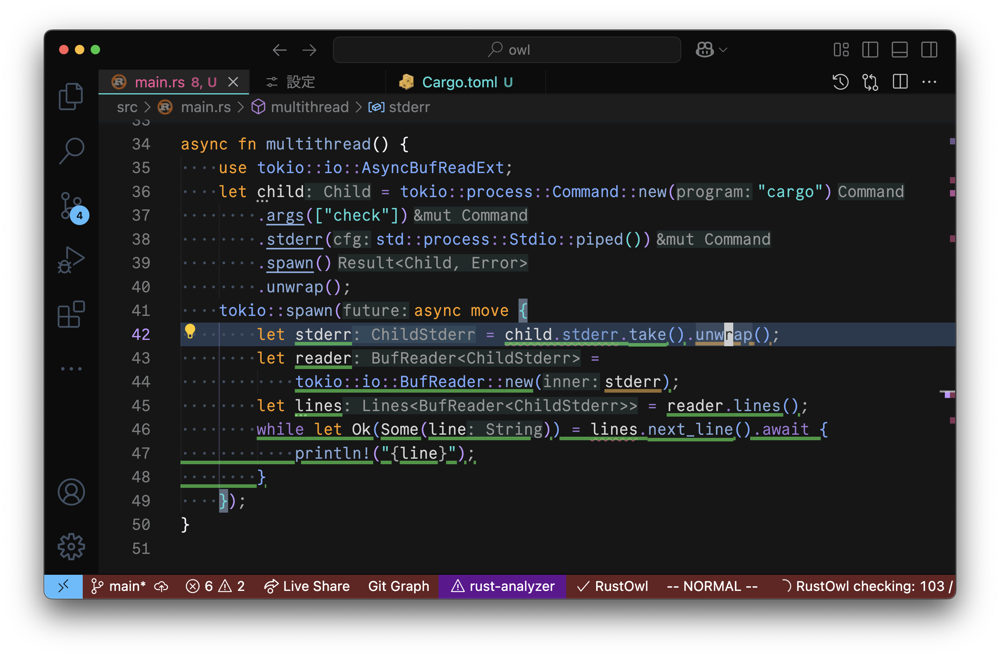
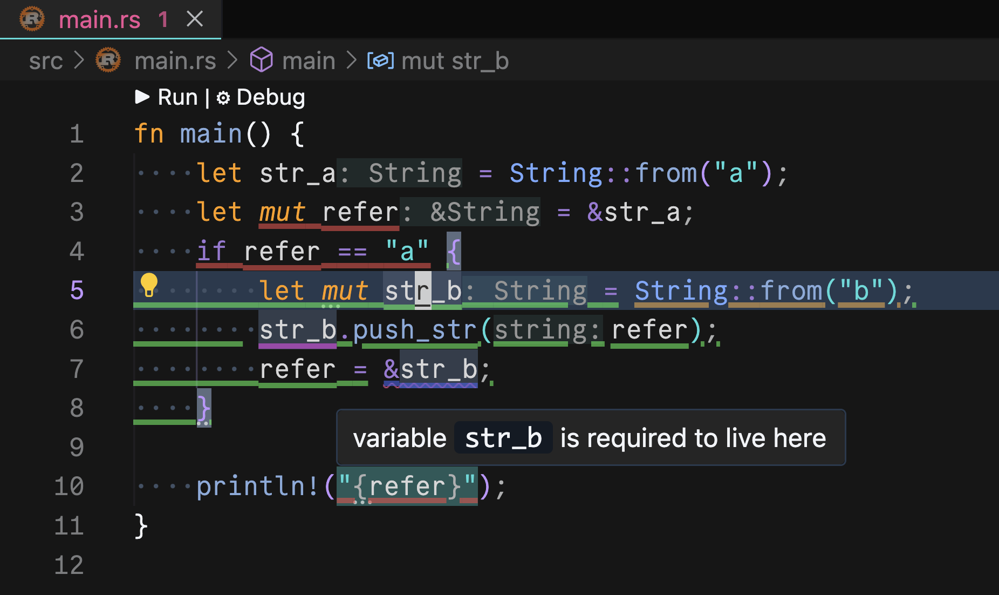

# RustOwl usage

Here, I describe how to use RustOwl in your workflow.

## Getting started

First, please install the RustOwl LSP server and extension for your editor.
Installation guide is on [the top page of this repository](/README.md).

Then, please open a Rust source code file (`.rs`) in the editor.
RustOwl only works with a Cargo workspace, so you need to open the source code that is part of a Cargo workspace.
I recommend you try RustOwl with a small, simple workspace first.
RustOwl's analysis may take a long time for a large workspace.

VS Code extension will automatically start analyzing the workspace.
For other editors, you may need to enable RustOwl manually, but you can enable automatic loading in your configuration file.
The progress of analysis will be shown in your editor.

After the analysis started, RustOwl waits for your request.
Please place the text cursor on a variable or function call you would like to inspect.

RustOwl works for the analyzed portion, even if the entire analysis has not finished.
If your program has some fatal errors (e.g., syntax errors or unrecoverable type errors), RustOwl cannot work for the part where the analysis failed.

Wait for a few seconds, and then the ownership-related operations and lifetimes of the variable to which the `unwrap()` method call assigns a value will appear.

## Basic usage

Basically, RustOwl can be used to resolve ownership and lifetime errors.
What RustOwl visualizes is:

- Actual lifetime of variables
- Shared (immutable) borrowing of variables
- Mutable borrowing of variables
- Value movement
- Function call
- Ownership and lifetime errors

You can see which color is assigned to them on the top page of this repository.
RustOwl can be used to see where a variable lives, where it dies, and where it is borrowed or moved.

For VS Code, you can see the message that explains the meaning of the underline by hovering your mouse cursor over it.

This is the basic usage of RustOwl!
Now you have a master's degree in RustOwl.

## Advanced usage

The lifetime that RustOwl visualizes is the range of these variables:

- Where the variable _lives_
    - For the meaning of _NLL_
- Until the variable is _dropped_ or _moved_
    - For the meaning of _RAII_

Based on this, we can use RustOwl as listed below:

- To resolve _dead lock_ that is caused by some data structures like `Mutex`
    - Because these _locks_ are freed where the lock object is dropped
- To manage resources
    - Like memories, files, and anything which is managed by _RAII_ respective

Did you get a Ph.D. in lifetimes?
So let's try managing resources with RustOwl.
You will get a Ph.D. in RustOwl and computer resource management.
